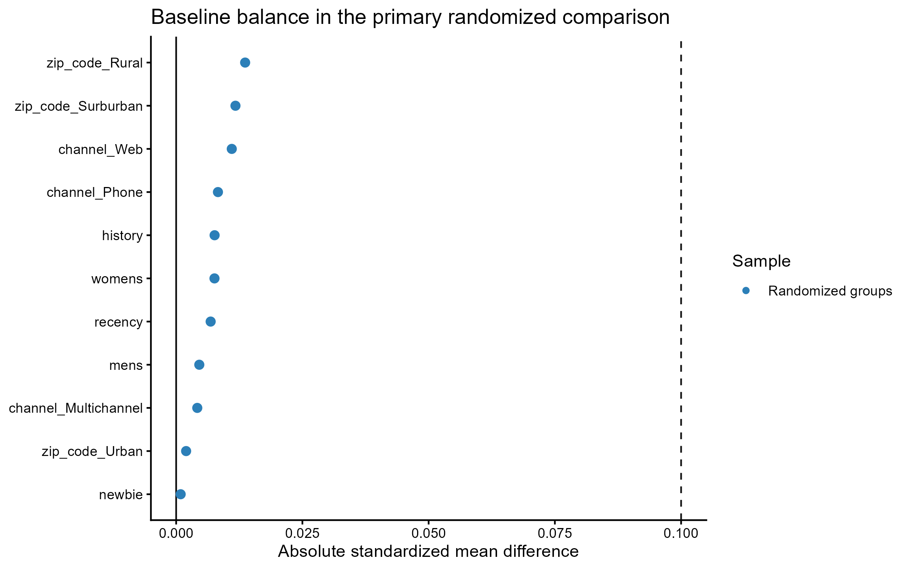
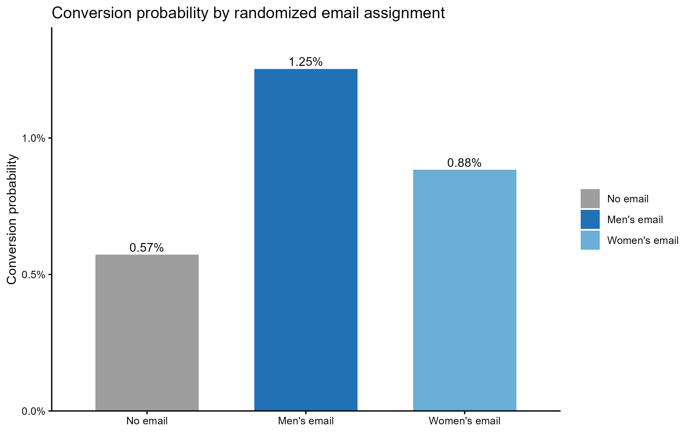
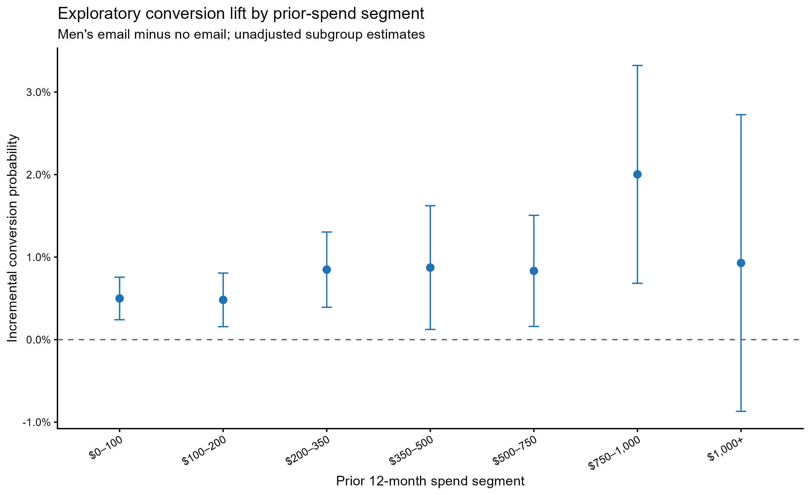

```{r setup, include=FALSE}
knitr::opts_chunk$set(
  echo = FALSE,
  message = FALSE,
  warning = FALSE,
  fig.width = 8,
  fig.height = 5
)

source("run_all.R")

library(dplyr)
library(readr)
library(knitr)
```

# Executive summary

This report analyzes a public randomized email experiment. The primary question is whether sending the Men's email, compared with sending no email, increased conversion and spend in the following two weeks. Random assignment supports a direct intention-to-treat comparison without propensity-score adjustment.

# Experimental design

Customers were randomly assigned to one of three arms: no email, Men's email, or Women's email. The primary analysis prespecifies Men's email versus no email. Conversion is the primary outcome; spend per customer is the business outcome, and site visit is an engagement outcome.

```{r all-arms}
all_arms <- read_csv("outputs/all_arm_summary.csv", show_col_types = FALSE)

kable(
  all_arms %>%
    mutate(
      `Visit probability` = scales::percent(
        visit_probability,
        accuracy = 0.1
      ),
      `Conversion probability` = scales::percent(
        conversion_probability,
        accuracy = 0.01
      ),
      `Spend per customer (USD)` = scales::dollar(
        spend_per_customer,
        accuracy = 0.01
      )
    ) %>%
    select(
      `Randomized assignment` = assignment,
      Individuals = individuals,
      `Visit probability`,
      `Conversion probability`,
      `Spend per customer (USD)`
    ),
  caption = "Observed outcomes across the three randomized arms"
)
```

# Randomization check

The primary groups should be balanced on pre-assignment customer characteristics. Balance is presented as standardized mean differences; values below 0.10 are generally small in magnitude.

```{r balance-plot, out.width='85%', fig.align='center'}

```

```{r balance-table}
balance <- read_csv("outputs/randomization_balance.csv", show_col_types = FALSE)

kable(
  balance,
  col.names = c(
    "Baseline characteristic",
    "Standardized mean difference",
    "Absolute SMD",
    "Balanced (<0.10)"
  ),
  digits = 3,
  caption = "Baseline balance: Men's email versus no email"
)
```

# Primary experiment estimates

Effects are absolute differences between the randomized Men's email and no-email groups. For binary outcomes, they are percentage-point differences; for spend, they are dollars per customer.

```{r effects}
effects <- read_csv("outputs/primary_effect_estimates.csv", show_col_types = FALSE)

kable(
  effects %>%
    mutate(
      `Control outcome` = if_else(
        outcome == "Spend per customer (USD)",
        scales::dollar(control_value, accuracy = 0.01),
        scales::percent(control_value, accuracy = 0.01)
      ),
      `Email outcome` = if_else(
        outcome == "Spend per customer (USD)",
        scales::dollar(treatment_value, accuracy = 0.01),
        scales::percent(treatment_value, accuracy = 0.01)
      ),
      `Incremental effect` = if_else(
        outcome == "Spend per customer (USD)",
        scales::dollar(incremental_effect, accuracy = 0.01),
        scales::percent(incremental_effect, accuracy = 0.01)
      ),
      `95% CI` = if_else(
        outcome == "Spend per customer (USD)",
        paste0(
          scales::dollar(lower_ci, accuracy = 0.01),
          " to ",
          scales::dollar(upper_ci, accuracy = 0.01)
        ),
        paste0(
          scales::percent(lower_ci, accuracy = 0.01),
          " to ",
          scales::percent(upper_ci, accuracy = 0.01)
        )
      ),
      `P value` = if_else(
        p_value < 0.001,
        "<0.001",
        sprintf("%.3f", p_value)
      )
    ) %>%
    select(
      Outcome = outcome,
      `Control n` = control_n,
      `Email n` = treatment_n,
      `Control outcome`,
      `Email outcome`,
      `Incremental effect`,
      `95% CI`,
      `P value`
    ),
  caption = "Primary randomized comparison: Men's email minus no email"
)
```

```{r conversion-plot, out.width='85%', fig.align='center'}

```

# Exploratory segmentation

The following subgroup estimates are exploratory. They describe whether conversion lift appears to vary by pre-campaign spending category; they should not be interpreted as a production targeting rule without validation in a new experiment.

```{r segmentation-plot, out.width='90%', fig.align='center'}

```

```{r segmentation-table}
segments <- read_csv(
  "outputs/exploratory_history_segment_effects.csv",
  show_col_types = FALSE
)

kable(
  segments %>%
    mutate(
      `Control conversion` = scales::percent(
        control_conversion,
        accuracy = 0.01
      ),
      `Email conversion` = scales::percent(
        treatment_conversion,
        accuracy = 0.01
      ),
      `Incremental conversion` = scales::percent(
        incremental_conversion,
        accuracy = 0.01
      ),
      `95% CI` = paste0(
        scales::percent(lower_ci, accuracy = 0.01),
        " to ",
        scales::percent(upper_ci, accuracy = 0.01)
      )
    ) %>%
    select(
      `Prior-spend segment` = history_segment,
      `Control n` = control_n,
      `Email n` = treatment_n,
      `Control conversion`,
      `Email conversion`,
      `Incremental conversion`,
      `95% CI`
    ),
  caption = "Exploratory conversion lift by prior-spend segment"
)
```

# Limitations

This public dataset reflects a historical email experiment rather than a contemporary Twitch product surface. The analysis demonstrates transferable experimentation principles: randomized assignment, intention-to-treat estimation, uncertainty intervals, business metrics, and cautious interpretation of heterogeneity.

# Reproducibility

The raw source data are downloaded locally and excluded from version control. Recreate the workflow from the repository root with:

```{r render-command, echo=TRUE, eval=FALSE}
source("run_all.R")

rmarkdown::render(
  "analysis_report.Rmd",
  output_file = "index.html",
  output_dir = "docs"
)
```
